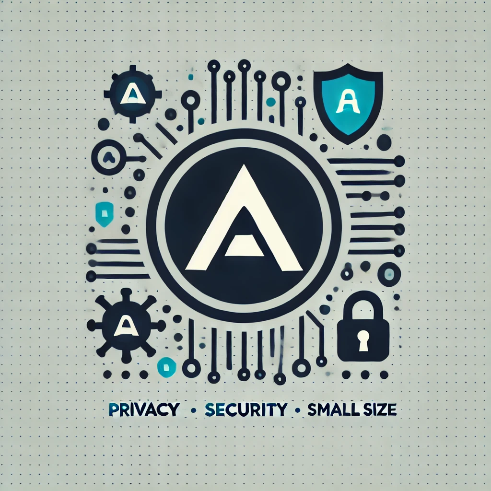

# ATI-OS

Minimalistic and secure operating system

**Licensing**: See the [LICENSE file](LICENSE.md)

# Features:

## I. Preparation scripts (**Linux only**)

- Small size
- Automation of the most processess related with getting, preparing, compiling and configuration

## II. Final product (Linux disribution):

1. Minimal core - The system base (core) itself contain only files required to start-up and run the system
2. Enchanced security - The system will be defaultly hardened and isolated to provide maximal possible protection. The hardenings include among others:

- kernel hardening
- minimal permissons for the core components of the system
- total isolation from "outside world" (all connections will be done thru secure tunnels)
- installed and configured security software
- multiple security layers

3. Small footprint - In oposite to other Linux distributions, except the security software, there won't be neither a GUI, nor other software preinstalled
4. Full customization - The administrators may freely customize the system (by installing the GUI and software at choice) according to the needs

# Requirments:

## Scripts:

I. 64-bit Debian based Linux distribution

II. All required packages needed to get, compile and prepare the Linux image file. Bellow, are few of them:

a) Build environment containing among others:
- build-essentials (install's allmost all software required for the compilation process)

- bison++
- CMake
- gcc
- c++
- libtool
- python3
- sqyashfs
- libssl-dev
- autotools (autoconf, automake)
- m4

b) Dependencies required by the third-patry software required to compile the sources

## Final product - portable (live) system

# IMPORTANT

1. The USB stick **need to meet** following criteria:

- must be cleaned using the `wipe` command to prevent any potential leftovers from previous data and potential malware

- must have a GPT partition table

- the partition `need` to be set bootable

2. The BIOS/UEFI `need` either to be set to run from USB before the hard drive or be run from a boot menu

3. You have propper tools to "burn" the Linux image to the USB stick

# Distribution preparation using included scripts

1. Get the content of the repository (one of):

a) using git clone (remember to use the `--recrusive` and `--recrusive-modules` options)

b) Download the archive from the repository and then extract it on your drive

From now, the folder to with the repository got clobed/extracted will be refered as the "*project dir*"

2. In the `project dir` enter the `code` sub-folder

3. ensure that the scripts are executable (command: `chmod -v +x *.sh`)

4. run the `prepare.sh` script

5. After the script finishes (assuming that it wasn't interrupted due an error), return to the `project dir` and then enter the `dist` sub-folder. Inside should be a Linux image that need to become "burned" into a USB stick. It can become also used in Virtual Machines
